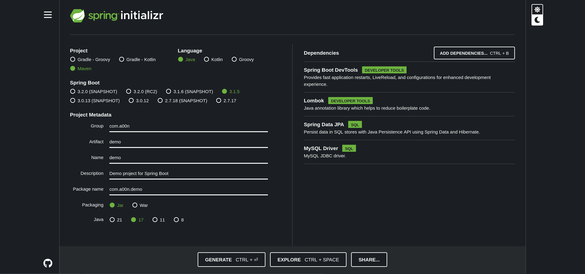
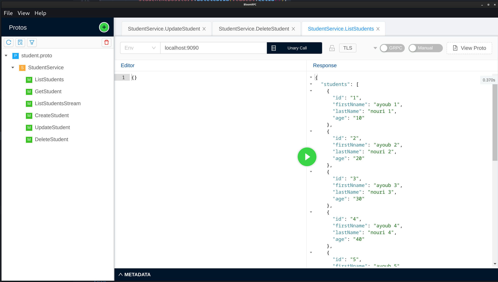

# gRPC with Spring Boot 

In this project, we will focus on the client-side implementation of a gRPC Spring Boot application. Our primary goal is to facilitate CRUD (Create, Read, Update, Delete) operations for managing student records. This involves functionalities such as adding new students, deleting existing records, updating student information, and efficiently retrieving and displaying a list of students using React programming and streams.
We will also leverage React programming to efficiently retrieve and display a list of students using streams.

## Server Setup

Follow these steps to set up the server:

### Create a spring boot project

Use spring initializr (or anything you want) and create a simple spring boot project



### Add maven dependencies

Include the following properties within your configuration:

```xml
<protobuf.version>3.23.4</protobuf.version>
<protobuf-plugin.version>0.6.1</protobuf-plugin.version>
<grpc.version>1.58.0</grpc.version>
```

Adding the following dependencies:

```xml
<dependency>
    <groupId>io.grpc</groupId>
    <artifactId>grpc-stub</artifactId>
    <version>${grpc.version}</version>
</dependency>
<dependency>
    <groupId>io.grpc</groupId>
    <artifactId>grpc-protobuf</artifactId>
    <version>${grpc.version}</version>
</dependency>
<dependency>
    <groupId>jakarta.annotation</groupId>
    <artifactId>jakarta.annotation-api</artifactId>
    <version>1.3.5</version>
    <optional>true</optional>
</dependency>
<dependency>
    <groupId>net.devh</groupId>
    <artifactId>grpc-spring-boot-starter</artifactId>
    <version>2.15.0.RELEASE</version>
</dependency>
```

Add the following plugin:

```xml
<plugin>
    <groupId>com.github.os72</groupId>
    <artifactId>protoc-jar-maven-plugin</artifactId>
    <version>3.11.4</version>
    <executions>
        <execution>
            <phase>generate-sources</phase>
            <goals>
                <goal>run</goal>
            </goals>
            <configuration>
                <includeMavenTypes>direct</includeMavenTypes>
                <inputDirectories>
                    <include>src/main/resources</include>
                </inputDirectories>
                <outputTargets>
                    <outputTarget>
                        <type>java</type>
                        <outputDirectory>src/main/java</outputDirectory>
                    </outputTarget>
                    <outputTarget>
                        <type>grpc-java</type>
                        <pluginArtifact>io.grpc:protoc-gen-grpc-java:1.15.0</pluginArtifact>
                        <outputDirectory>src/main/java</outputDirectory>
                    </outputTarget>
                </outputTargets>
            </configuration>
        </execution>
    </executions>
</plugin>
```

### Creating the gRPC-Service Definitions

Place your protobuf definitions / `.proto` files in `src/main/resources`. For writing protobuf files please refer to the official [protobuf docs](https://developers.google.com/protocol-buffers/docs/proto3).

Your `.proto` files will look similar to the example below:

```protobuf
syntax = "proto3";
option java_package = "com.a00n.grpc.stubs";

message Student {
  int64 id = 1;
  string firstName = 2;
  string lastName = 3;
  int64 age = 4;
}
message Empty {}

service StudentService {
  rpc ListStudents(Empty) returns (ListStudentsResponse);
  rpc GetStudent(GetStudentRequest) returns (Student);
  rpc CreateStudent(CreateStudentRequest) returns (Student);
  rpc UpdateStudent(Student) returns (Student);
  rpc DeleteStudent(DeleteStudentRequest) returns (DeleteStudentResponse);
}

message ListStudentsResponse { repeated Student students = 1; }
message GetStudentRequest { int64 id = 1; }
message DeleteStudentRequest { int64 id = 1; }
message DeleteStudentResponse { string message = 1; }
message CreateStudentRequest {
  string firstName = 1;
  string lastName = 2;
  int64 age = 3;
}
```

- run `mvn clean install`

- Please observe that the package `grpc.studs` has been generated. Inside this package, you should find two Java files: `StudentOutClass` and `StudentServiceGrpc`

### Create a student jpa entity

First let's create our jpa entity :

```java
import jakarta.persistence.Entity;
import jakarta.persistence.GeneratedValue;
import jakarta.persistence.GenerationType;
import jakarta.persistence.Id;
import lombok.AllArgsConstructor;
import lombok.Builder;
import lombok.Data;
import lombok.NoArgsConstructor;

@Entity
@Data
@Builder
@AllArgsConstructor
@NoArgsConstructor
public class Student {
    @Id
    @GeneratedValue(strategy = GenerationType.IDENTITY)
    private Long id;
    private String firstName;
    private String lastName;
    private Long age;

}
```

also as always you should create the repositories :

```java
@Repository
public interface StudentRepository extends JpaRepository<Student, Long> {
}
```

### Mapping Grpc Student with Jpa Student

Now let's create a class that will map objects of Grpc student class to objects of jpa student class :

```java
@Component
public class StudentMapper {
    public com.a00n.grpc.stubs.StudentOuterClass.Student toGrpcStudent(Student student) {
        return com.a00n.grpc.stubs.StudentOuterClass.Student.newBuilder().setId(student.getId())
                .setFirstName(student.getFirstName())
                .setLastName(student.getLastName())
                .setAge(student.getAge())
                .build();
    }

    public Student fromGrpcStudent(com.a00n.grpc.stubs.StudentOuterClass.Student student) {
        return new Student(student.getId(), student.getFirstName(), student.getLastName(), student.getAge());
    }
}
```

### Implementing the Service

The `protoc-jar-maven-plugin` plugin generates a class for each of your grpc services. For example: `MyServiceGrpc` where `MyService` is the name of the grpc service in the proto file. This class contains both the client stubs and the server `ImplBase` that you will need to extend.

After that you have only four tasks to do:

1. Make sure that your `MyServiceImpl` extends `MyServiceGrpc.MyServiceImplBase`
2. Add the `@GrpcService` annotation to your `MyServiceImpl` class
3. Make sure that the `MyServiceImpl` is added to your application context,
   - either by creating `@Bean` definition in one of your `@Configuration` classes
   - or placing it in spring’s automatically detected paths (e.g. in the same or a sub package of your `Main` class)
4. Actually implement the grpc service methods.

Your grpc service class will then look somewhat similar to the example below:

```java
@GrpcService
@RequiredArgsConstructor
public class GrpcStudentServiceIml extends StudentServiceGrpc.StudentServiceImplBase {

    private final StudentRepository studentRepository;
    private final StudentMapper studentMapper;

    @Override
    public void listStudents(Empty request, StreamObserver<ListStudentsResponse> responseObserver) {
        List<Student> students = studentRepository.findAll();
        List<StudentOuterClass.Student> listStudents = students.stream()
                .map(studentMapper::toGrpcStudent)
                .toList();
        ListStudentsResponse listStudentsResponse = ListStudentsResponse.newBuilder()
                .addAllStudents(listStudents)
                .build();
        responseObserver.onNext(listStudentsResponse);
        responseObserver.onCompleted();
    }

    @Override
    public void listStudentsStream(Empty request,
                                   StreamObserver<StudentOuterClass.Student> responseObserver) {
        List<Student> students = studentRepository.findAll();
        List<StudentOuterClass.Student> listStudents = students.stream()
                .map(studentMapper::toGrpcStudent)
                .toList();
        if (listStudents.isEmpty()) {
            responseObserver.onError(Status.INTERNAL.withDescription("no student found").asException());
        } else {
            Stack<StudentOuterClass.Student> stackStudents = new Stack<>();
            stackStudents.addAll(listStudents);
            Timer timer = new Timer("students timer");
            timer.schedule(new TimerTask() {

                @Override
                public void run() {
                    responseObserver.onNext(stackStudents.pop());
                    if (stackStudents.isEmpty()) {
                        responseObserver.onCompleted();
                        timer.cancel();
                    }
                }

            }, 0, 1000);
        }
    }

    @Override
    public void getStudent(GetStudentRequest request,
                           StreamObserver<StudentOuterClass.Student> responseObserver) {
        Student student = studentRepository.findById(request.getId()).orElse(null);
        if (student == null) {
            responseObserver.onError(Status.INTERNAL.withDescription("student not found").asException());
        } else {
            responseObserver.onNext(studentMapper.toGrpcStudent(student));
            responseObserver.onCompleted();
        }
    }

    @Override
    public void createStudent(CreateStudentRequest request,
                              StreamObserver<StudentOuterClass.Student> responseObserver) {
        Student student = Student.builder().firstName(request.getFirstName()).lastName(request.getLastName()).age(request.getAge()).build();
        responseObserver.onNext(studentMapper.toGrpcStudent(studentRepository.save(student)));
        responseObserver.onCompleted();
    }

    @Override
    public void updateStudent(StudentOuterClass.Student request,
                              StreamObserver<StudentOuterClass.Student> responseObserver) {
        if (studentRepository.existsById(request.getId())) {
            Student student = studentRepository.save(studentMapper.fromGrpcStudent(request));
            responseObserver.onNext(studentMapper.toGrpcStudent(student));
            responseObserver.onCompleted();
        } else {
            responseObserver.onError(Status.INTERNAL.withDescription("student not found").asException());
        }
    }

    @Override
    public void deleteStudent(DeleteStudentRequest request,
                              StreamObserver<DeleteStudentResponse> responseObserver) {
        if (studentRepository.existsById(request.getId())) {
            studentRepository.deleteById(request.getId());
            DeleteStudentResponse deleteStudentResponse = DeleteStudentResponse.newBuilder()
                    .setMessage("Student Deleted").build();
            responseObserver.onNext(deleteStudentResponse);
            responseObserver.onCompleted();
        } else {
            responseObserver.onError(Status.INTERNAL.withDescription("student not found").asException());
        }
    }
}
```

That’s all there is to that. Now you can start your spring-boot application and start sending requests to your grpc-service.

By default, the grpc-server will be started on port `9090` using `PLAINTEXT` mode.
You can test that your application is working as expected by using this [BloomRPC](https://github.com/bloomrpc/bloomrpc/releases) :



## Authors

- [A00N](https://github.com/Ay0ubN0uri)
